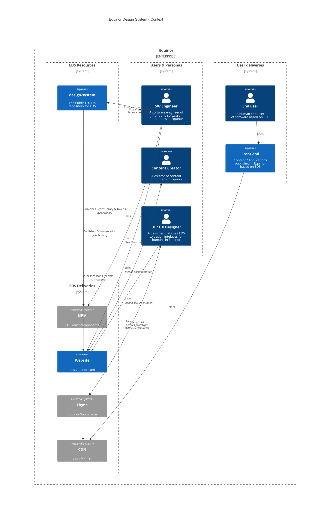

# Architecture

Diagrams based on [C4Model](https://c4model.com)

## Context diagram



## Container

### Figma

```mermaid
C4Context
    title Equinor Design System - Container
```

### Documentation Portal

```mermaid
C4Context
    title Equinor Design System - Container
```

## Components
