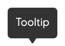

# Tooltip

_Tooltip_ show when hovered, focused or long-pressed (touch), and display information such as a text label or a short description.

## When to use

The information provided should be very short and descriptive and explain icon meanings or differences between components.

- Tooltips should aim to have a single line of text that does not wrap, and is kept to under 80 characters in length
- The position of the tooltip is flexible, and they should always point to the component to which they give information about

## Guidelines

Tooltips disappear after the mouse is no longer hovering the target area, the focus has moved on or the long-press is released. The information provided should be very short and descriptive and explain icon meanings or differences between components.

Tooltips should aim to have a single line of text that does not wrap, and is kept to under 80 characters in length. The position of the tooltip is flexible, and they should always point to the component to which they give information about.

## Accessibility

Keep in mind that if `Tooltip` is added to a non-focusable element, it is inaccessible to people dependent on keyboard navigation and assistive technologies.

## Styling

Tooltip have the classname ``eds-tooltip`` to make it easier to style the component globally, including tooltips built into other eds components such as ``Sidebar``. Individual tooltips can otherwise be styled with ``style``, ``className`` or ``styled(Tooltip)``.

## Implementation in Figma

1.  In Figma go to the **Assets Panel** and search for **tooltip**.
2.  Drag and drop the component in your frame.
3.  Choose the variant from the **Design Panel**.

## Do's and don'ts

✅  Use single/short line of text

❌  Do not format the text, such as bold or italics

❌  Do not add images, such as avatars or icons

❌  Do not have links within tooltips