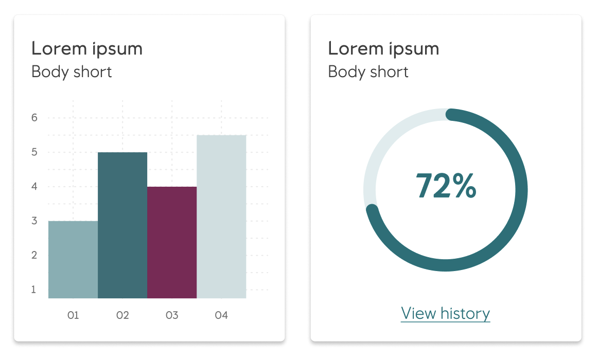

# Card

A _card_ is a thoughtfully designed container that displays content related to a single subject, creating an inviting entry point to more detailed information. Designed with care to organize information in digestible blocks, cards inspire users to explore content while maintaining visual clarity and purposeful navigation throughout our interfaces.

<iframe 
        class="sb-iframe"
        src="
        https://storybook.eds.equinor.com/iframe.html?globals=&args=&id=surfaces-card--introduction
        "
        width="100%"
        height="550"
        frameborder="1"
        ></iframe>

[View in Storybook](https://storybook.eds.equinor.com/?path=/docs/surfaces-card--docs)

## When to Use

Use _cards_ when you want to present content in organized, scannable blocks that help users navigate information efficiently. Cards are perfect for displaying related content that benefits from clear boundaries and visual hierarchy, making complex information feel approachable and actionable.

## Structure

The card consists of flexible, thoughtfully organized elements that work together seamlessly:

#### Container
The container serves as the foundation and is the only required element, with four available options to suit different needs.

- Danger
- Default
- Info
- Warning

#### Title 

Title blocks provide clear headings with eleven variations to match your content structure. The eleven title block variations include: 
- Heading 1 (largest, for main card titles)
- Heading 2
- Heading 3
- Heading 4
- Heading 5
- Heading 6
- Subtitle 1
- Subtitle 2
- Caption
- Overline
- Body Title

Each variation differs in size, weight, and emphasis, allowing you to select the most appropriate style for your card's hierarchy and context.

Action blocks can contain various interactive elements including overflow menus, controls, and chips.

Rich media blocks showcase visual content with three strategic placements:
  - Leading image for impactful first impressions
  - Middle placement for content flow
  - Last position for supporting visuals

 Rich media content can include graphs, tables, images, and dividers that enhance understanding.

#### Supplemental actions

Supplemental actions offer users clear next steps through buttons, icons, UI controls, and supporting text. A rule of thumb is to place them at the bottom of a card.

Action blocks can contain various interactive elements including overflow menus, controls, and chips

Each element is designed to create meaningful connections between content and user actions.

## Guidelines

- Place supplemental actions at the bottom of a card to create a natural flow from content to action
- Use full-width dividers for expandable content, ignoring horizontal spacing to create clear visual separation
- Choose container types that best support your content hierarchy and user needs
- Ensure rich media placement supports the story you're telling - leading images for impact, middle placement for context, and trailing media for support
- Combine card blocks thoughtfully to create cohesive information architecture that guides users naturally through the content

## Accessibility

Cards are designed with accessibility in mind to ensure all users can navigate and interact with content effectively. Use proper heading hierarchy within cards and ensure interactive elements have clear focus indicators and descriptive labels.

## Implementation in Figma

1. In Figma go to the **Assets Panel** and search for **card**.
2. Drag and drop the component in your frame.
3. Rename and resize the component if needed.
4. Choose the variant from the **Design Panel**.

## Do's and don'ts

✅  Follow guidelines when placing the cards

❌  Do not use cards inside other cards

❌  Do not use cards with text over photography or illustrations

❌  Do not use cards as/or in navigation drawers

❌  Do not use cards to group large sets of information