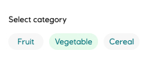
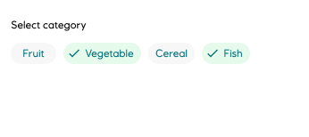
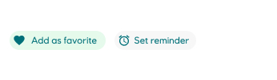

# Chip

_Chips_, also known as tags or badges, are advanced badges that represent discrete information.

<iframe 
        class="sb-iframe"
        src="
        https://storybook.eds.equinor.com/iframe.html?globals=&args=&id=data-display-chips--text
        "
        width="100%"
        height="250"
        frameborder="1"
        ></iframe>

[View in Storybook](https://storybook.eds.equinor.com/?path=/docs/data-display-chips--docs)

## When to Use

Chips allow users to enter information, make selections, filter content, or trigger actions.

- Chips are **compact** components that represent discrete information
- Chips should be **relevant** to the content or task they represent
- Chips should make tasks easier to complete, or content easier to sort

## Structure

#### Choice chip

Choice chips are used when there are at least two predefined options to choose between to signify the user's choice.

#### Filter chip

Multiple predefined keywords can be listed for the user to choose from. Multiple chips can be selected or unselected.

#### Action chip

When there are at least two predefined options to choose between, action chips trigger actions related to the primary content. Action chips are not removable but can appear dynamically.

## Guidelines

Chips allow users to make selections, perform an action, input information and attributes, filter content and complete tasks. Chips can transform from free text or predefined text.

## Implementation in Figma

1. In Figma go to the **Assets Panel** and search for **chip**.
2. Drag and drop the component in your frame.
3. Choose the variant from the **Design Panel**.

## Do's and don'ts

✅ Chips can be used as status indicators

❌ Do not use chips as a call-to-action
