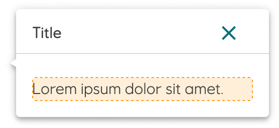

# Popover

A _popover_ is a floating card that provides more information or actions on hover or click.

<iframe 
        class="sb-iframe"
        src="
        https://storybook.eds.equinor.com/iframe.html?globals=&args=&id=data-display-popover--introduction
        "
        width="100%"
        height="300"
        frameborder="1"
        ></iframe>

[View in Storybook](https://storybook.eds.equinor.com/?path=/docs/data-display-popover--docs)

## When to Use

Popovers provide excess or additional information that does not fit in the main content area.

- A popover displays rich content in a non-modal dialog to describe or add additional information when users hover over, focus on, or click an interactive element
- User can interact with popover content

## Variants

#### Activate `onHover`

## Guidelines

A popover always has an indicator (caret) towards the area in which it is attached. Popovers should never be wider than 560px and their height should not be taller than 80% of the screen.

To dismiss a popover, use the close icon, press the `Esc` key, open another popover or click outside the popover. If there are no actions in the popover, then the close icon should be the first focusable element.

Caret direction (indicator) towards the attached area (available in all directions).

## Accessibility

It is recommended to use `trapFocus` in every Popover which contains active elements.

- While using a keyboard `trapFocus` brings focus onto the first active element in a Popover

## Implementation in Figma

1. In Figma go to the **Assets Panel** and search for **popover**.
2. Drag and drop the component in your frame.
3. Choose the variant from the **Design Panel**.

## Do's and don'ts

✅ Use sparingly

❌ Do not use for a single short line of text, use a tooltip instead

❌ Do not have multiple popovers open at the same time
