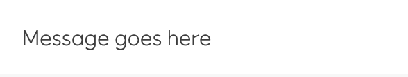
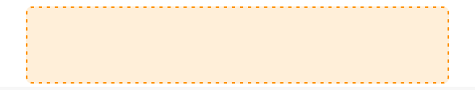
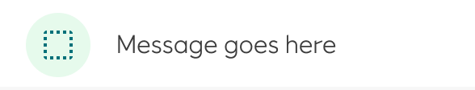

# Banner

_Banners_ display important notifications and related optional actions.

## When to use

A banner displays an important, brief message, and provides actions for users to address. It requires a user action to be dismissed.

- Banners are interruptive, but their level of interruption should match the information they hold and the context in which they appear
- Only one banner should be shown at a time

## Structure

#### Text

#### Actions

- Buttons in banners should directly relate to a banner’s message and clearly represent the banner’s action
- Buttons must be labelled with text, not icons, for clarity
- Place buttons under the banner message, or on the same line if there is enough room to fit both

#### Text + icon

Banners can supplement their message using a supporting icon.

## Guidelines

Banners should communicate a change or error and require an action in order to be dismissed. Banners deliver medium priority information while *snackbars* deliver low priority and *dialogs* deliver high priority. Banners are meant to be slightly interruptive but not overly distracting.

#### Placement

Banners are always at the top of the page but below the _top bar_. Banners can be fixed or scroll away with content. They should fill 100% of the width of the main content area. They are not to go over open _navigation drawers_ or fixed _side sheets_ but beside them.

Banners are notification elements and should not be confused with *top bars*, which are navigation elements at the top of an interface.

## Complex Content (special cases)

While using string content for ``Banner.Message`` is the recommended approach for most use cases, there are situations where more complex content might be necessary. For these special cases, Banner supports ReactNode as children, so you can nest them directly.

- Use string content for ``Banner.Message`` whenever possible to maintain consistency and proper styling.
- Only use complex content inside Banner when you have specific requirements that cannot be met with string content.
- When using complex content in Banner, be mindful of accessibility, responsive behavior, and Equinor design guidelines.

Some examples where complex content inside Banner might be appropriate:

- Content requiring specific formatting (bold text, code elements)
- Content with structured information that benefits from hierarchical display
- Content with links

## Implementation in Figma

1. In Figma go to the **Assets Panel** and search for **Banner**.
2. Drag and drop the component in your frame.
3. Rename and resize the component if needed.
4. Choose the variant from the **Design Panel**.

## Do's and don'ts

✅  Use only one banner at the time

❌  Do not include links in the banner text

❌  Do not place the banner above the top bar