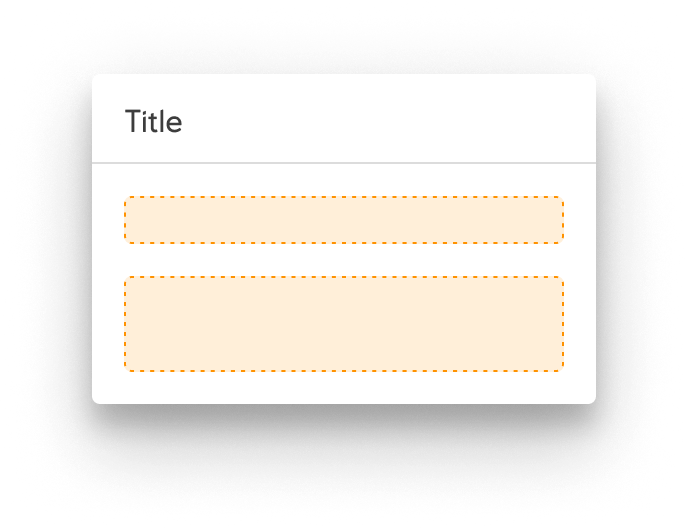
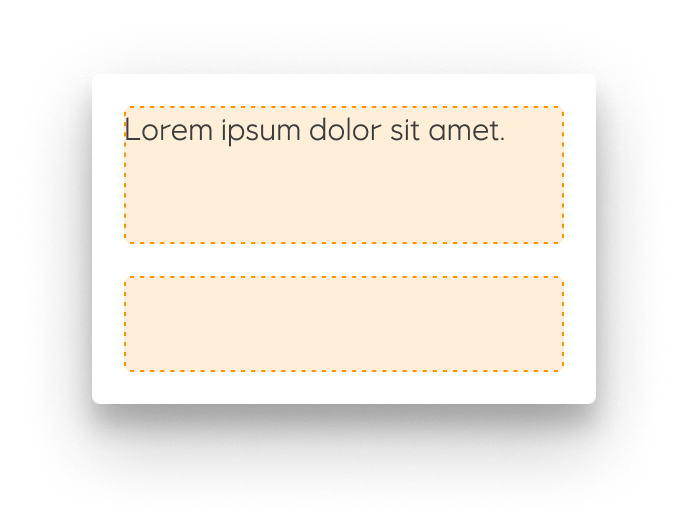

# Dialog

_Dialogs_ display critical notifications and required actions.

## When to use

Dialogs disable all app functionality when they appear, and remain on screen until confirmed, dismissed, or a required action has been taken. Dialogs are purposefully interruptive, so they should be used sparingly.

- Dialogs **focus** user attention to ensure their content is addressed
- Dialogs should be **direct** in communicating information and dedicated to completing a assignment
- Dialogs should appear in response to a user task or an action, with suitable or contextual information

## Variants

#### Dismissable

Closes the dialog on click outside and the ``Esc`` key

#### Text + action

- A dialog can have one or two actions, but never a third.
- Actions should always be related to the message.

#### Placeholder + action

#### Placeholder only

Simple dialogs can display items that are immediately actionable when selected.

#### Scrollable + action

Most dialog content should avoid scrolling.

- When scrolling is required, the dialog title is pinned at the top, with action buttons pinned at the bottom. This ensures selected content stays visible alongside the title and buttons, even upon scroll.
- Dialog does not scroll with elements outside of the dialog, such as the background.

#### No title

## Guidelines

A dialog is a modal window that appears over everything on the screen and always over a . Dialogs can appear without warning and require users to stop their current task so they should be used sparingly. The dialog disables all application functionality and requires an action to be taken in order to be dismissed.

Dialogs can contain a Title, Content and Actions. A dialog can have one or two actions, but never a third. Actions should always be related to the message. Dialogs should try to avoid scrollable content. When scrolling is necessary, the title and actions are fixed and the content scrolls.

In the notification family, dialogs are the most interruptive. *Banners* deliver medium priority slightly interruptive notifications, and *snackbar* deliver low priority un-interruptive notifications. Since dialogs are very disruptive, they should be used only in critical situations.

## Implementation in Figma

1. In Figma go to the **Assets Panel** and search for **dialog**.
2. Drag and drop the component in your frame.
3. Rename and resize the component if needed.
4. Choose the variant from the **Design Panel**.

## Do's and don'ts

❌  A dialog should never have more than two actions