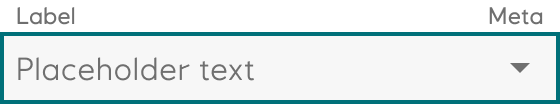
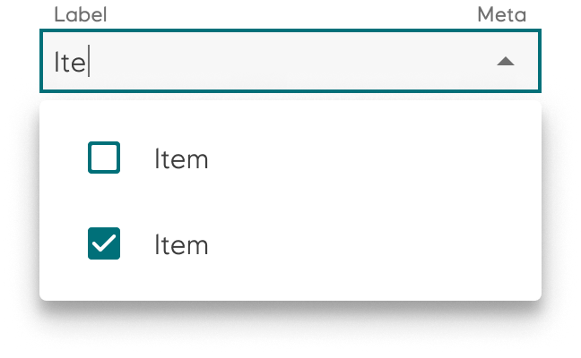

# Autocomplete

The _autocomplete_ (previously called select) component allows users to choose one or multiple items or options from a list.

<iframe 
        class="sb-iframe"
        src="
        https://storybook.eds.equinor.com/iframe.html?globals=&args=&id=inputs-autocomplete--introduction
        "
        width="100%"
        height="400"
        frameborder="1"
        ></iframe>

[View in Storybook](https://storybook.eds.equinor.com/?path=/docs/inputs-autocomplete--docs)

## When to Use

A select can be used in different settings:

- to filter or sort content on a page
- to submit data

## Structure

- Autocomplete
- Autocomplete multi

   

## Guidelines

The `autocomplete` variant is used to choose only one option from a list. The `autocomplete multi` variant is used if multiple choices can be applied.

A `native select` component is also available for implementation. We recommend using native autocomplete on products with limited space as it provides a better user experience.

## Accessibility

The property ``label`` is mandatory and makes sure you have a descriptive label for screen readers.

## Implementation in Figma

1. In Figma go to the **Assets Panel** and search for **autocomplete**
2. Drag and drop the component in your frame
3. Rename and resize the component if needed
4. Choose the variant from the **Design Panel**.
