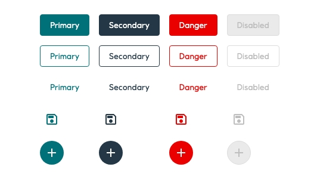

# Button

_Buttons_ allow users to take action with a single click or tap.

<iframe 
        class="sb-iframe"
        src="
        https://storybook.eds.equinor.com/iframe.html?globals=&args=&id=inputs-button-button--basic
        "
        width="100%"
        height="80"
        frameborder="1"
        ></iframe>

[View in Storybook](https://storybook.eds.equinor.com/?path=/docs/inputs-button-button--docs)

## When to Use

## Structure

- Contained
- Contained with icon
- Outlined
- Ghost
- Ghost with icon

## Hierarchy

### Buttons

Use variants to differentiate the hierarchy.

- Contained - being high-emphasis
- Outlined - being medium-emphasis
- Ghost - being low-emphasis

#### Guidelines

There are `primary`, `secondary` and `danger` colour buttons available in the `contained`, `outlined` and `ghost` variations. All variations can have the following: an icon on the left, an icon on the right, an icon with no text and text only with no icon. When using an icon, it must be directly related to the action and label of the button.

#### Accessibility

The ``aria-disabled`` attribute makes it possible to semantically disable the ``Button`` without hiding it from assistive technologies, such as screen readers. In EDS, the ``Button`` will be visually styled as disabled, but it is up to the developer to actually disable the button.

### Toggle buttons

``Toggle buttons`` allow users to select one of multiple options with a single click or tap.

#### Guidelines

EDS has one set of primary toggle buttons with either an icon and no text, or text and no icon. When using an icon it must be directly related to the action of the button.

Toggle buttons group a set of related actions in one shared common container. Only one option in a group of toggle buttons can be selected and active at a time. Selecting one option deselects any other. 

#### Accessibility

Button.Toggle sets ``aria-pressed="bool"`` according to the button state. You should provide an accessible label with ``aria-label="label"``, ``aria-labelledby="id"`` or ``<label>``.

#### Compact

Compact mode is toggled using EdsProvider.

::: Note
The compact mode should come with the possibility to switch to normal mode for accessibility reasons.
:::

## Implementation in Figma

1. In Figma go to the **Assets Panel** and search for **button**.
2. Drag and drop the component in your frame.
3. Rename and resize the component if needed.
4. Choose the variant from the **Design Panel**.

## Do's and don'ts

✅  Buttons in groups should always have the same colour except if one of the buttons is disabled. Try and be as consistent as possible throughout the app

✅  Use variants to differentiate hierarchy

✅  Danger buttons should always have an opposite order of what’s used in “positive” actions. This is used as an extra level of security in case the user acts with automatic choices. Therefore, if the user hits enter, the “cancel” button is pressed instead of “delete”

✅  You can use an icon to help clarify an action. Always use icons that clearly communicate their intended purpose

❌  Do not apply the same colour to all the buttons in a group. Use variants (contained, outlined, ghost) to differentiate the hierarchy instead

❌  Do not use the same variant for all action buttons since the user needs to understand which call to action has the most emphasis

❌  Do not wrap text over multiple lines. Scale the width to make the text fit on one line. Don´t adjust the height of the button

❌  Do not assign the same order to danger buttons as the “positive” action button groups (primary + secondary), use the opposite (secondary + primary) instead

❌  Do not use an icon that can mislead the main action