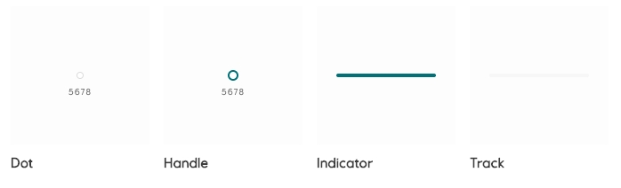

# Slider

A _slider_ is a flexible input that allows users to adjust predefined values.

<iframe 
        class="sb-iframe"
        src="
        https://storybook.eds.equinor.com/iframe.html?globals=&args=&id=inputs-slider--introduction
        "
        width="100%"
        height="150"
        frameborder="1"
        ></iframe>

[View in Storybook](https://storybook.eds.equinor.com/?path=/docs/inputs-slider--docs)

## When to use

Sliders reflect the current state of the settings they control.

- Sliders should be used for making selections from a range of values.
- When interacting with a slider, changes should be reflected back to a user immediately.
- Sliders should present the full range of choices that are available to a user.

## Structure

- Dot
- Handle
- Indicator
- Track

## Guidelines

Sliders reflect values along a bar where users can select a single value or a range of values. Sliders reflect the current state of the values they control, and value changes are immediate to the content in which they belong.

## Implementation in Figma

1. In Figma go to the **Assets Panel** and search for **slider**.
2. Drag and drop the component in your frame.
3. Rename and resize the component if needed.
4. Choose the variant from the **Design Panel**.

## Do's and don'ts

✅ Use a title for the slider

❌ Do not use a slider without a title indicating what slider controls

❌ Do not use ranges that are extremely different, e.g. 1-10000

❌ Do not use ranges that are very small, e.g. 1-4
