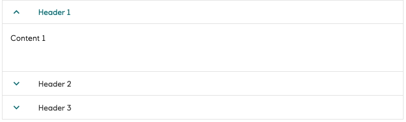

# Accordion

An _accordion_ is a thoughtfully designed component that empowers users to collapse and expand sections of content, creating a clean and organized interface. Designed with care to help manage information density while maintaining usability, accordions inspire focused exploration and keep our pages scannable and purposeful.

## When to Use

Use accordions when you need to present large amounts of related information in user-controlled sections. Accordions are perfect for grouping or organizing content that helps maintain order and scannability on a page, allowing users to focus on what matters most to them while keeping secondary information easily accessible.

## Structure

#### Header area

Area that serves as the interactive element for expanding and collapsing sections

#### Content area

Area that appears when expanded, revealing detailed information

It provides a clear visual hierarchy that guides users through their exploration

Each accordion is composed of these essential elements working together to deliver information in digestible, user-controlled sections.

## Guidelines

#### Header area

Whether expanded or collapsed, the header height must be 48px. The header area must contain one action indicating that the section expands or collapses and can contain additional actions. The expand/collapse functionality is tied to the entire header. Additional actions are triggered only by interacting directly with that action.

#### Labels

Labels should be to the point, short and no more than three words. Note that if the label is longer than the maximum width, it will be truncated and should have a _tooltip_ provided.

#### Content area

When the accordion is expanded, the minimum height for the content area is 96px. There is no maximum height for the content area.

#### Interaction

Multiple sections can be expanded simultaneously.

## Implementation in Figma

1. In Figma go to the **Assets Panel** and search for **accordion**
2. Drag and drop the component in your frame
3. Rename and resize the component if needed
4. Choose the variant from the **Design Panel**

## Do's and don'ts

✅  Accordions can deliver large amounts of information in user-controlled sections

❌  Do not use for small amounts of content

❌  Do not hide errors or critical information that requires immediate action inside an accordion

❌  Do not change the width of the accordion when it is expanded or collapsed