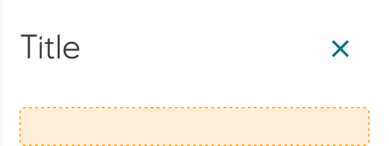

# Side sheet

A _side sheet_ is a thoughtfully designed toggleable area that anchors gracefully to the edge of the viewport, providing a dedicated space for supplementary content. Designed with care to enhance the user experience without overwhelming the primary interface, side sheets inspire efficient workflows while maintaining clear visual hierarchy and purposeful content organization.

## When to Use

Use a side sheet when you want to provide easy access to supplementary content without disrupting the primary user experience. Side sheets are perfect for presenting contextual actions, filters, additional functionality, or organized content tabs that help users focus on what matters most while keeping supporting information readily accessible.

## Structure

The side sheet consists of carefully considered elements that work together harmoniously:

- **Anchored positioning** that elegantly attaches to the viewport edge, aligned to the left of the right edge for optimal accessibility
- **Full-height layout** that maximizes available space while respecting existing interface elements
- **Flexible sizing options** with multiple sizes to accommodate different content needs
- **Adaptive placement** that can start under existing navigation elements when present

Each element is designed to create a seamless extension of your interface while maintaining clear boundaries and user orientation.

### Sizes

The side sheet comes in multiple sizes:

Small, Medium, Large and X-Large

*(Size: Medium)*

## Guidelines

- Always provide clear and intuitive ways to open and close the side sheet, ensuring users feel confident in their ability to control the interface
- Choose between elevation strategies based on your content needs:
  - Use `Elevation/Overlay` to elevate the side sheet over primary content for temporary focus
  - Push primary content to share the same elevation for more integrated, persistent workflows
- Consider the content hierarchy and user flow when deciding which approach best serves your users' goals

## Accessibility

Side sheets are designed with accessibility as a core principle to ensure all users can navigate and interact with supplementary content effectively. Implement proper focus management, keyboard navigation support, and clear screen reader announcements when the side sheet opens or closes.

## Implementation in Figma

1. In Figma go to the **Assets Panel** and search for **side sheet**.
2. Drag and drop the component in your frame.
3. Rename and resize the component if needed.
4. Choose the variant from the **Design Panel**.

## Do's and don'ts

❌  Do not remove the close icon

❌  Do not use a left anchored side sheet if you are using a navigation drawer
