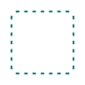
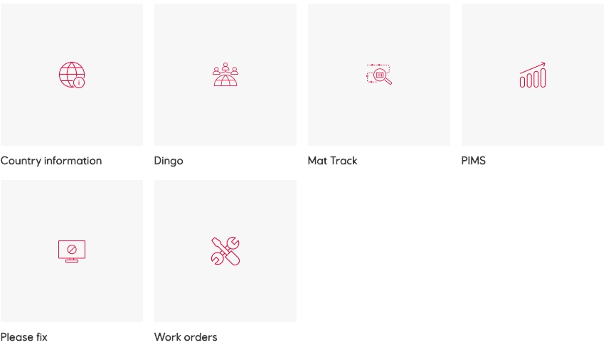

# Product icons

Product icons communicate key themes and business areas in a clear, simple and branded style. They enhance visual communication, assist with navigation and reduce cognitive load. Product icons do not provide functional interaction, use system icons instead.

## Guidelines

The EDS product icons are built on top of the Equinor  guidelines for iconography.

Product icons are used in app icons, app launchers and splash screens always with the name of the product they represent. Simple and clear icons require a strict underlying grid. The EDS icons are built on a 48x48px grid. Product icons can scale up, but not down, depending on context in the grid shape.

:::danger Don't
-   Product icons are not to be used as system icons
-   Product icons are not used for marketing or decoration
:::

## Design

## Implementation in Figma

1.  Locate the **Assets** tab in the **Layers Panel**.
    
2.  There are two ways to locate the `Product icon` component needed:
    
    1.  Use the search bar to search for a component grouping name or variation name.
        
    2.  Scroll through the folders list and open the relevant grouping.
        
3.  Once the component needed is located, click and drag it into the frame/artboard.
    
4.  Hold `Shift` when resizing the `Product icon` to retain its aspect ratio.

## Library

### Generic

  
Placeholder product icon

### Mobility

## Contribution

Missing a product icon? You can make it following these simple guidelines

-   First make sure that the icon you are missing does not already exist by searching for all associated keywords in the library
-   Reuse icons when appropriate, however, if the product icon might cause confusion between products consider creating a new, noticeably different product icon
-   All icons should be understandable regardless of language or location
    

### Style

Our icons are constructed using simple single-colour keylines. To reflect the rounded corners of the logo, product icons have rounded corners.

Each icon needs to be reduced to its minimal form, being bold, geometrical and symmetrical. To reflect the rounded corners of the logo, icons need to have rounded corners of 1px. To reflect the brand, icons use a consistent stroke of 1px this includes curves, angles and both interior and exterior strokes.

The EDS icons are always facing forward and never rotated or dimensional. The icons are made for legibility and are not too literal or complex, neither are they overly playful or bubbly.

:::danger Don'ts
-   Do not create product icons that are filled, always use outlines  
-   Do not create product icons that contain multiple colours
-   Do not use multiple stroke weights
-   Do not apply square corners or square line ends
-   Do not create product icons with more than three objects
-   Do not create product icons with hands holding objects
:::    

:::warning Exceptions
Optical corrections are not allowed in product icons
:::

### Making a new icon

-   Create an artboard that is 48x48px
    -   Place the `Product icon grid` from the **Utilities** page from **Assets File** as the bottom layer and lock the layer
    -   Choose the grid shape: circle, square, vertical rectangle or horizontal rectangle
    -   Make sure to align all artwork to the pixel grid
        
-   Line tool vs shape
    -   Never use centre borders, centering can cause half pixels
    -   If you're using borders or the line tool, be certain to outline (expand) the icon
        

### Submitting your new icon

-   When your icon has been created, delete the `Product icon grid` layer that you had locked
-   Make sure your icon is not grouped or nested
-   Make sure all your layers are named logically
-   Make sure to name the icon what it is to avoid interpretative names that will make the icon hard to search and find
    -   If you make a filled icon to supplement the outlined icon, both icons need to have this stated in their name  
    
    :::tip For example
    **add circle filled** and **add circle outlined**
    :::
        
-   Pick a category for the icon to live under. Reference the library for current categories

Get in touch with the EDS core team designers for further assistance