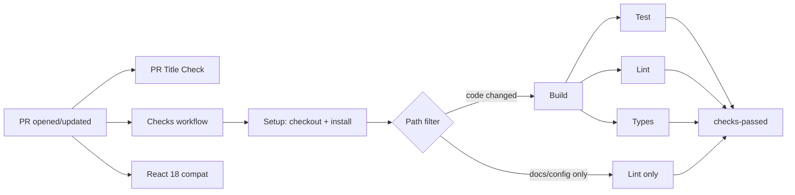
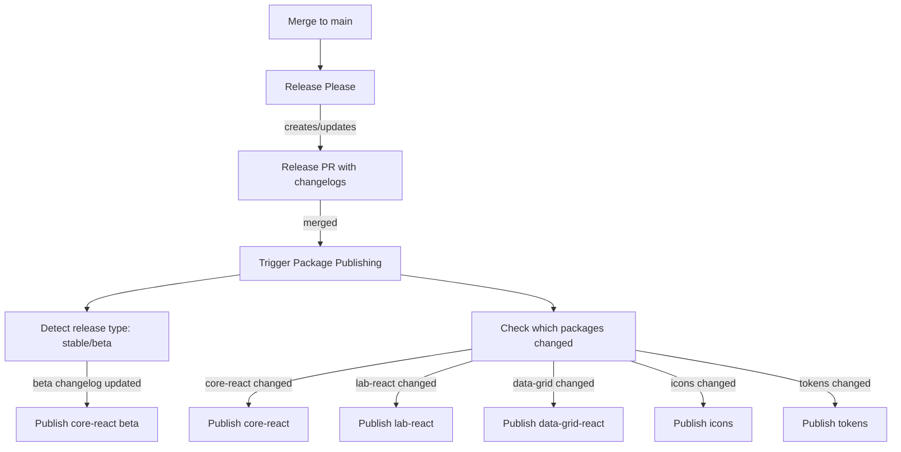

# CI/CD Overview

This document provides a high-level overview of all GitHub Actions workflows in the Equinor Design System repository, how they connect, and how to use them.

## Workflow Inventory

### Automated (triggered by events)

| Workflow                                                    | Trigger                          | Purpose                                               |
| ----------------------------------------------------------- | -------------------------------- | ----------------------------------------------------- |
| **Checks** (`checks.yaml`)                                  | PR to `main`, push to `main`     | Build, test, lint, and type-check in parallel         |
| **React 18 compatibility** (`react18-compat.yaml`)          | PR to `main` (packages changes)  | Verify compatibility with React 18                    |
| **PR Title Check** (`pr-title-check.yml`)                   | PR opened/edited                 | Validate conventional commit format                   |
| **Release Please** (`release_please.yml`)                   | Push to `main`                   | Create/update release PR with changelogs              |
| **Trigger Package Publishing** (`trigger_publish.yml`)      | Release PR merged                | Detect changed packages and trigger publish workflows |
| **Publish core-react storybook** (`publish_storybook.yaml`) | Push to `main` (package changes) | Deploy Storybook to Azure                             |
| **Claude Code** (`claude.yml`)                              | `@claude` mentions in issues/PRs | AI-powered code assistance                            |
| **Issue triage** (`issue-triage.yml`)                       | Issue opened                     | Auto-triage new issues with Claude                    |
| **Close stale issues** (`stale-issues.yml`)                 | Daily (06:00 UTC)                | Close issues labelled `issue needs work` after 3 days |
| **Dependabot rotation** (`dependabot-rotation.yml`)         | Weekly (Monday 05:00 UTC)        | Slack reminder for Dependabot duty                    |

### Manual (workflow_dispatch)

| Workflow                                                 | Purpose                                                     |
| -------------------------------------------------------- | ----------------------------------------------------------- |
| **Publish core-react** (`publish_core_react.yaml`)       | Publish `@equinor/eds-core-react` to npm (next/latest/beta) |
| **Publish icons** (`publish_icons.yaml`)                 | Publish `@equinor/eds-icons` to npm                         |
| **Publish tokens** (`publish_tokens.yaml`)               | Publish `@equinor/eds-tokens` to npm                        |
| **Publish lab-react** (`publish_lab.yaml`)               | Publish `@equinor/eds-lab-react` to npm                     |
| **Publish data-grid-react** (`publish_data_grid.yaml`)   | Publish `@equinor/eds-data-grid-react` to npm               |
| **Publish assets to CDN** (`publish_assets_to_cdn.yaml`) | Upload assets to Azure CDN                                  |
| **Sync Figma to tokens** (`sync-figma-to-tokens.yml`)    | Pull Figma variables into canonical tokens                  |
| **Sync tokens to Figma** (`sync-tokens-to-figma.yml`)    | Push tokens back to a Figma file                            |
| **Set up Azure environment** (`setup_azure.yaml`)        | Deploy Azure infrastructure (Bicep)                         |
| **Purge CDN** (`purge_cdn.yaml`)                         | Manually purge CDN cache                                    |
| **Playwright tests** (`playwright.yml`)                  | Run E2E tests for Color Palette Generator                   |

### Reusable (called by other workflows)

| Workflow                            | Purpose                                 |
| ----------------------------------- | --------------------------------------- |
| **\_Setup** (`_setup.yml`)          | Checkout, install deps, cache workspace |
| **\_Purge CDN** (`_purge_cdn.yaml`) | Purge Azure CDN endpoints               |

### \_Setup reusable workflow

`_setup.yml` is the shared entry point for almost every other workflow (~10 callers). It runs as a single job that:

1. Checks out the repository with `actions/checkout@v7` (`fetch-depth: 1`)
2. Restores the pnpm store cache (key: `${{ runner.os }}-pnpm-store-${{ hashFiles('pnpm-lock.yaml') }}`, with a `restore-keys` fallback)
3. Installs Node via `actions/setup-node@v7` and pnpm via `pnpm/action-setup@v6`
4. Installs dependencies with `pnpm install --frozen-lockfile`
5. Saves the full workspace (`./*` + `~/.pnpm-store`) under the caller-supplied `cacheKey` so downstream jobs can restore it

**Inputs:** `cacheKey` (required), `tag` (optional, defaults to `next`).
**Outputs:** `tag` (resolved package tag).
**Node version** is centralised in the `NODE_VERSION` env var.

:::warning

`--frozen-lockfile` will fail the run if `pnpm-lock.yaml` is out of sync with any `package.json`. If a dependency was added without committing the updated lockfile, the setup job fails fast — commit the regenerated lockfile to fix it.

:::

## PR Pipeline

When a pull request targets `main`, the following happens:

**Path filtering:** If only documentation, workflows, or config files changed, the checks workflow runs the lint-only path (test/types are skipped), and it builds first so type-aware linting can resolve cross-package types.

## Release Pipeline

Releases follow the [Release Please](https://github.com/googleapis/release-please) convention:

### How it works

1. Conventional commits on `main` are analyzed by **Release Please**
2. Release Please creates/updates a PR that bumps versions and updates changelogs
3. When the release PR is merged, **Trigger Package Publishing** runs
4. It reads `.github/release-please-manifest.json` to detect which packages changed
5. Individual publish workflows are triggered via `gh workflow run`
6. Each publish workflow: builds → publishes to npm → deploys Storybook (if applicable)

### Package publish dependencies

- `eds-core-react` and `eds-lab-react` both depend on `eds-utils` -- utils is published first
- Beta releases of `eds-core-react` add `/next` exports and read version from `version.txt`

### Trusted publishing (OIDC)

All npm publishes use [npm trusted publishing](https://docs.npmjs.com/trusted-publishers) rather than a long-lived `NPM_TOKEN`:

- Each publish job requests an OIDC token via `permissions: id-token: write`
- `actions/setup-node` sets `registry-url: 'https://registry.npmjs.org'` so npm authenticates through the OIDC exchange
- Packages are published with `--provenance`, which attaches a signed provenance attestation visible on npmjs.com
- Trusted publishing must be configured per package on npmjs.com (Settings → Trusted publishers) for the exchange to succeed

## Storybook Deployment

The core-react Storybook is deployed to Azure Blob Storage in two ways:

1. **On push to main** -- `publish_storybook.yaml` automatically deploys to the development environment
2. **On npm publish** -- `publish_core_react.yaml` deploys as part of the publish pipeline

Other packages (data-grid, lab) deploy their own Storybooks during their publish workflows.

## Required Secrets & Variables

### Secrets (configured in repository settings)

| Secret                                            | Used by                                             | Purpose                                    |
| ------------------------------------------------- | --------------------------------------------------- | ------------------------------------------ |
| `SLACK_WEBHOOK_URL`                               | Most workflows                                      | Failure notifications                      |
| `SLACK_WEBHOOK_URL_EDS_CORE`                      | `dependabot-rotation.yml`                           | Core team Slack channel                    |
| `AZ_STORYBOOK_CONNECTION_STRING`                  | `publish_storybook.yaml`, `publish_core_react.yaml` | Azure Blob Storage for core Storybook      |
| `AZ_STORAGE_STORYBOOK_DATAGRID_CONNECTION_STRING` | `publish_data_grid.yaml`                            | Azure Blob Storage for data-grid Storybook |
| `AZ_STORAGE_STORYBOOK_LAB_CONNECTION_STRING`      | `publish_lab.yaml`                                  | Azure Blob Storage for lab Storybook       |
| `AZURE_SUBSCRIPTION`                              | `setup_azure.yaml`                                  | Azure subscription ID                      |
| `TEST_GITHUB_CDN_ACCESS`                          | `publish_assets_to_cdn.yaml`                        | SSH key for CDN repo                       |
| `DEPLOY_KEY_INTERNAL`                             | `setup_azure.yaml`                                  | SSH key for internal infra repo            |
| `GH_ACTION_VARIABLES_SYNC_FIGMA_TOKEN`            | Figma sync workflows                                | Figma API access                           |
| `ANTHROPIC_API_KEY`                               | `claude.yml`                                        | Claude AI integration                      |

### Variables (configured in repository settings)

| Variable                         | Scope           | Used by                      | Purpose                                                           |
| -------------------------------- | --------------- | ---------------------------- | ----------------------------------------------------------------- |
| `AZURE_CLIENT_ID`                | **Environment** | Azure login workflows        | Federated credential client ID (per-environment app registration) |
| `AZURE_TENANT_ID`                | Repository      | Azure login workflows        | Federated credential tenant ID (shared across environments)       |
| `AZURE_CDN_PROFILE_NAME`         | Environment     | `_purge_cdn.yaml`            | CDN profile name                                                  |
| `AZURE_CDN_ENDPOINT_NAME`        | Environment     | `_purge_cdn.yaml`            | CDN endpoint name                                                 |
| `AZURE_STORYBOOK_ENDPOINT_NAME`  | Environment     | `_purge_cdn.yaml`            | Storybook CDN endpoint                                            |
| `AZURE_RESOURCE_GROUP`           | Environment     | `_purge_cdn.yaml`            | Azure resource group                                              |
| `AZURE_CDN_CONTAINER_NAME`       | Environment     | `publish_assets_to_cdn.yaml` | CDN blob container                                                |
| `AZURE_CDN_STORAGE_ACCOUNT_NAME` | Environment     | `publish_assets_to_cdn.yaml` | CDN storage account                                               |

:::warning

`AZURE_CLIENT_ID` must be set as an **environment-level** variable (not repository-level) on each GitHub environment (`development`, `production`). Each environment can point to a different Azure app registration. `AZURE_TENANT_ID` is a repository-level variable since the tenant is shared.

All workflows that perform Azure login declare `environment:` on the job, so `${{ vars.AZURE_CLIENT_ID }}` resolves from the environment scope.

:::

:::info

npm publishing no longer uses an `NPM_TOKEN` secret — see [Trusted publishing (OIDC)](#trusted-publishing-oidc) above.

:::

## Troubleshooting

### PR checks are slow or failing

- **Cache miss:** `_setup.yml` saves the workspace under the caller's `cacheKey` (typically `${{ github.sha }}-<workflow>`), while the pnpm store is cached separately under `${{ runner.os }}-pnpm-store-${{ hashFiles('pnpm-lock.yaml') }}`. If a cache was evicted, setup re-runs from scratch. Check the Actions cache tab.
- **Lockfile out of sync:** `pnpm install --frozen-lockfile` fails if `pnpm-lock.yaml` doesn't match `package.json`. Commit the regenerated lockfile.
- **Build failure:** Build must succeed before test/lint/types can run. Check the build job first.
- **Skipped jobs:** If only docs changed, build/test/types are intentionally skipped via path filtering.

### Publish workflow fails

- **npm auth / OIDC error:** Publishing uses npm trusted publishing (OIDC), not `NPM_TOKEN`. If publishing fails with an authentication or provenance error, verify the package has a trusted publisher configured on npmjs.com (Settings → Trusted publishers) and that the publish job has `permissions: id-token: write`.
- **Cache miss in build job:** The build job restores from setup cache. If setup cache was evicted between jobs (rare), the build will fail. Re-run the workflow.
- **Beta version mismatch:** Beta publishes read from `packages/eds-core-react/src/components/next/version.txt`. Ensure this file is updated before triggering a beta publish.

### Storybook deployment fails

- **Connection string issues:** Storybook deploys authenticate with the storage connection string via the `deploy-storybook` action; they do **not** run `azure/login`. Each Storybook target has its own secret (`AZ_STORYBOOK_CONNECTION_STRING`, `AZ_STORAGE_STORYBOOK_DATAGRID_CONNECTION_STRING`, `AZ_STORAGE_STORYBOOK_LAB_CONNECTION_STRING`). Verify the correct one is configured for the environment.
- **Missing deploy action:** The `publish-storybook` jobs restore a workspace cache that excludes dot-directories, so they sparse-checkout `.github` before invoking `./.github/actions/deploy-storybook`. An "action not found" error usually means that checkout step is missing.

### Azure OIDC login fails (setup, purge-cdn, publish-assets)

- **Azure login failure:** The OIDC workflows (`setup_azure`, `_purge_cdn`, `publish_assets_to_cdn`) authenticate via `azure/login`. Verify `AZURE_CLIENT_ID` (an **environment** variable, set on both `development` and `production`) and `AZURE_TENANT_ID` (a **repository** variable) exist, and that the calling job grants `id-token: write`.

### Release Please not detecting changes

- Ensure commits follow [conventional commit format](./CONVENTIONAL_COMMITS.md)
- Check `.github/release-please-config.json` for `exclude-paths` -- some paths are intentionally excluded from version bumps
- Hidden types (`chore`, `build`, `ci`, `docs`, `test`) don't trigger version bumps

## Related Documentation

- [Automated Release Guide](./AUTOMATED_RELEASE.md) -- How Release Please works
- [Beta Release Guide](./BETA_RELEASE_GUIDE.md) -- EDS 2.0 dual-channel release strategy
- [Conventional Commits](./CONVENTIONAL_COMMITS.md) -- Commit message format
