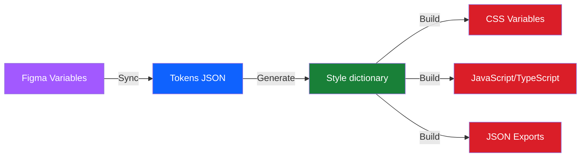
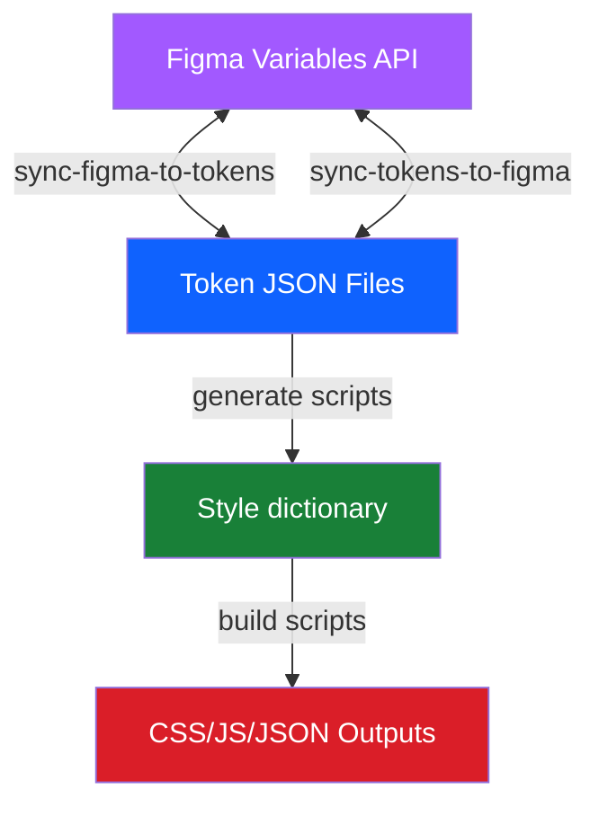

# Token System Guide

This guide provides a comprehensive walkthrough of the <abbr title="Equinor Design System">EDS</abbr> token system – from Figma setup through syncing, building, and implementation. It covers the complete token lifecycle and serves as documentation for working with design tokens in the EDS.

## Table of Contents

- [Source of Truth](#source-of-truth)
- [Figma and Code Harmony](#figma-and-code-harmony)
- [Token Categories](#token-categories)
- [Variable Collections and Modes](#variable-collections-and-modes)
- [Token Sync Workflow](#token-sync-workflow)
- [Building Tokens](#building-tokens)
- [Code Syntax and Usage](#code-syntax-and-usage)
- [Figma API Setup](#figma-api-setup)
- [Figma Library Workflow](#figma-library-workflow)
- [Troubleshooting and Pitfalls](#troubleshooting-and-pitfalls)
- [Quick Reference](#quick-reference)

## Source of Truth

### Figma

Design tokens in the EDS originate in **Figma as Variable Collections**. The token name and structure (built from groups, modes, and names) are defined in Figma.

- Design tokens are **created and maintained in Figma**
- Token values are defined in Figma variables
- Code is **synced from Figma** to stay up-to-date

### Tokens in code

- Token JSON files in `packages/eds-tokens/tokens/` are **generated from Figma**
- Code builds (CSS, JS/TS, JSON) are generated from token JSON files
- Using the Tokens in code to update values, descriptions and codeSyntax is very handy.

### Token Flow Overview



### Keep It Simple

**Simplicity is key**: If you add complexity in Figma (nested references, special naming), you'll need to handle it in the build system. Keep Figma variables straightforward and let the build system work as intended without to much customization.

### Harmony in Practice

When you create a new variable in Figma:

1. **Name it semantically** -- `bg/accent/fill-emphasis/default` (uses `/` separators in Figma)
2. **Set code syntax** -- `--eds-color-bg-accent-fill-emphasis-default` (what it becomes in CSS)
3. **Sync to code** -- Run `pnpm run update-tokens` in `packages/eds-tokens`
4. **Generate/build** -- Run appropriate generate and build scripts
5. **Use in code** -- `var(--eds-color-bg-accent-fill-emphasis-default)`

The variable name in Figma determines the CSS variable name in code. No manual mapping required.

## Token Categories

The EDS token system includes three main categories:

### Colors

Color tokens define the visual palette and semantic color system.

**Foundation Colors** (`GnovDpL3UV6X51Ot7Kv6Im`):

- Base color palettes (Gray, North Sea, Moss Green, Blue, Red, Orange, Green, etc.)
- Light and Dark variants for each palette
- Location: `packages/eds-tokens/tokens/GnovDpL3UV6X51Ot7Kv6Im/`
- Example: `Color Light.Mode 1.json`, `Color Dark.Mode 1.json`

**Static Semantic Colors** (`OWxw2XogDLUt1aCvcDFXPw`):

- Explicit semantic variables with category in the name
- Pattern: `--eds-color-bg-[semantic]-[role]-[state]`
- Location: `packages/eds-tokens/tokens/OWxw2XogDLUt1aCvcDFXPw/`
- Example: `--eds-color-bg-accent-fill-emphasis-default`
- See [colors-static.md](../../packages/eds-tokens/instructions/colors-static.md) for details

**Dynamic Appearance Colors** (`nyPaQ3QnI1UAcxKW4a0d2c`):

- Abstract role variables without semantic category
- Pattern: `--eds-color-bg-[role]-[state]`
- Semantic meaning set via `data-color-appearance` attribute
- Location: `packages/eds-tokens/tokens/nyPaQ3QnI1UAcxKW4a0d2c/`
- Example: `--eds-color-bg-fill-emphasis-default` + `data-color-appearance="accent"`
- See [colors-dynamic.md](../../packages/eds-tokens/instructions/colors-dynamic.md) for details

**Color Scheme** (Generated):

- Intermediate layer mapping semantic categories to foundation palettes
- Generated from foundation tokens using `token-config.json`
- Not synced from Figma -- created during build
- Pattern: `{Accent.9}` → `{Light.Moss Green.9}` (Light mode)

**Concept Colors** (Generated):

- Special-purpose global colors outside semantic scales
- Examples: `bg-floating`, `bg-backdrop`, `bg-input`, `border-focus`, `text-link`
- Defined in `token-config.json` under `conceptColorGroups`
- Applied to both static and dynamic approaches

### Spacing

Spacing tokens define layout dimensions, gaps, and padding.

**Primitives** (`cpNchKjiIM19dPqTxE0fqg`):

- Base spacing scales (horizontal/vertical dimensions)
- Icon sizes and gaps
- Inset padding scales
- Location: `packages/eds-tokens/tokens/cpNchKjiIM19dPqTxE0fqg/`

**Modes** (`FQQqyumcpPQoiFRCjdS9GM`):

- Density variations (Spacious vs Comfortable)
- Component sizes (XS, SM, MD, LG, XL, 2XL)
- Context-specific spacing (Selectable, Container, etc.)
- Border radius (None, Rounded, Pill)
- Stroke width (Thin, Thick, None)
- Location: `packages/eds-tokens/tokens/FQQqyumcpPQoiFRCjdS9GM/`

### Typography

Typography tokens are currently handled separately and not synced from Figma:

- Font families (UI: Inter, Header: Equinor)
- Font sizes (xs through 6xl)
- Font weights, line heights, letter spacing (tracking)
- Build with `build:variables:typography-and-spacing` script

## Variable Collections and Modes

### Understanding Collections

A **Variable Collection** in Figma groups related variables together. Each collection maps to a folder in the token structure.

**EDS Collections:**

| Collection         | Figma File Key           | Purpose                  | Modes                                           |
| ------------------ | ------------------------ | ------------------------ | ----------------------------------------------- |
| Foundation Colors  | `GnovDpL3UV6X51Ot7Kv6Im` | Base color palettes      | Light, Dark                                     |
| Static Semantic    | `OWxw2XogDLUt1aCvcDFXPw` | Explicit semantic colors | Mode 1                                          |
| Dynamic Appearance | `nyPaQ3QnI1UAcxKW4a0d2c` | Abstract role colors     | Accent, Neutral, Info, Success, Warning, Danger |
| Spacing Primitives | `cpNchKjiIM19dPqTxE0fqg` | Base spacing values      | Value                                           |
| Spacing Modes      | `FQQqyumcpPQoiFRCjdS9GM` | Contextual spacing       | Multiple (Size, Density, etc.)                  |

### Understanding Modes

**Modes** allow a single variable collection to have multiple value sets. The active mode determines which values are used.

**Common Mode Patterns:**

1. **Theme Modes** (Light/Dark):

   ```
   Foundation Colors
   ├── Light Mode: #f7f7f7
   └── Dark Mode: #1a1a1a
   ```

2. **Density Modes** (Spacious/Comfortable):

   ```
   Spacing Density
   ├── Spacious: 16px
   └── Comfortable: 12px
   ```

3. **Semantic Modes** (Accent/Neutral/Success/etc.):
   ```
   Dynamic Appearance
   ├── Accent Mode: References {Accent.*}
   ├── Neutral Mode: References {Neutral.*}
   └── Success Mode: References {Success.*}
   ```

### File Naming Convention

Token files follow this pattern: `[Collection Name].[Mode Name].json`

Examples:

- `Color Light.Mode 1.json` -- Collection "Color Light", Mode "Mode 1"
- `💎 Density.Comfortable.json` -- Collection "💎 Density", Mode "Comfortable"
- `🎨 Appearance.Accent.json` -- Collection "🎨 Appearance", Mode "Accent"

⚠️ Collection and mode names in Figma **must match exactly** to file names. Renaming in Figma requires renaming the JSON file.

### Variable References

Variables can reference other variables using curly brace syntax: `{Collection.Path.To.Variable}`

**Reference Chain Example:**

```
Static Semantic Variable
└── {Accent.9}                                    (Color Scheme)
    └── {Light.Moss Green.9} (Light Mode)        (Foundation)
        └── #206f77                               (Raw value)
    └── {Dark.Moss Green.9} (Dark Mode)          (Foundation)
        └── #8cd2da                               (Raw value)
```

This creates a **layered token system**:

1. **Foundation** -- Raw color values
2. **Color Scheme** -- Semantic category mapping
3. **Semantic/Appearance** -- Role-based variables

## Token Sync Workflow

### Sync Architecture

The EDS uses a **bidirectional sync** between Figma and code powered by the `@equinor/eds-tokens-sync` package.



### Syncing from Figma to Code

Use this when **designers update Figma variables** and you need to pull changes into code.

**Sync All Collections:**

```bash
cd packages/eds-tokens
pnpm run update-tokens
```

This runs:

- `update-tokens:foundations` - Syncs foundation colors
- `update-tokens:color-static` - Syncs static semantic colors
- `update-tokens:color-dynamic` - Syncs dynamic appearance colors
- `update-tokens:spacing-primitives` - Syncs spacing primitives
- `update-tokens:spacing-modes` - Syncs spacing modes

**Sync Individual Collections:**

```bash
# Foundation colors only
pnpm run update-tokens:foundations

# Static semantic colors only
pnpm run update-tokens:color-static

# Spacing modes only
pnpm run update-tokens:spacing-modes
```

**What Happens:**

1. Connects to Figma REST API using `FIGMA_ACCESS_TOKEN` environment variable
2. Fetches all variables from the specified file key
3. Transforms Figma variables to W3C token format
4. Writes JSON files to `tokens/[project-id]/[Collection].[Mode].json`
5. Preserves variable references in token values

**Implementation:**

Package: `@equinor/eds-tokens-sync`  
Script: `src/scripts/sync_figma_to_tokens.ts`  
CLI: `bin/sync-figma-to-tokens.js`

### Syncing from Code to Figma

Use this when you need to **push token changes back to Figma**
💡 This works well to update token values and adding description and codeSyntax.
💡 You can always use history in Figma to revert the changes

```bash
cd packages/eds-tokens
pnpm run update-figma
```

Or for individual collections:

```bash
pnpm run update-figma:foundations
pnpm run update-figma:color-static
```

**What Happens:**

1. Reads token JSON files from `tokens/[project-id]/`
2. Compares with existing Figma variables
3. Generates CREATE/UPDATE/DELETE operations
4. Posts changes to Figma API
5. Updates variable values and references

**Implementation:**

Package: `@equinor/eds-tokens-sync`  
Script: `src/scripts/sync_tokens_to_figma.ts`  
CLI: `bin/sync-tokens-to-figma.js`

### When to Sync

**Sync from Figma to Code when:**

- ✅ Designers update color values
- ✅ New variables are added in Figma
- ✅ Variable names or structure changes

## Building Tokens

Building transforms synced token JSON files into consumable formats (CSS, JavaScript, JSON).

### Build Pipeline


### Build Scripts

Build scripts use **Style Dictionary** to transform tokens into final outputs.

**Build All Color Variables:**

```bash
cd packages/eds-tokens
pnpm run build:variables:color
```

This runs three builds:

1. `build:variables:color-scheme` -- Foundation colors with `light-dark()` function
2. `build:variables:semantic:static` -- Static semantic variables
3. `build:variables:semantic:dynamic` -- Dynamic appearance variables

**Build Color Scheme Variables:**

```bash
pnpm run build:variables:color-scheme
```

Generates CSS variables using the `light-dark()` CSS function for automatic theme switching:

```css
:root {
  --eds-color-foundation-gray-1: light-dark(#f7f7f7, #1a1a1a);
  --eds-color-foundation-moss-green-7: light-dark(#4db5bc, #206f77);
}
```

**Implementation:**  
Package: `@equinor/eds-tokens-build`  
Script: `src/scripts/build-color-scheme-variables.ts`  
Transform: `src/transform/lightDark.ts`

**Build Static Semantic Variables:**

```bash
pnpm run build:variables:semantic:static
```

Creates explicit semantic CSS variables:

```css
[data-color-scheme='light'] {
  --eds-color-bg-accent-fill-emphasis-default: #206f77;
  --eds-color-text-accent-strong-on-emphasis: #fff;
}

[data-color-scheme='dark'] {
  --eds-color-bg-accent-fill-emphasis-default: #4db5bc;
  --eds-color-text-accent-strong-on-emphasis: #000;
}
```

**Implementation:**  
Package: `@equinor/eds-tokens-build`  
Script: `src/scripts/build-semantic-static-variables.ts`

**Build Dynamic Appearance Variables:**

```bash
pnpm run build:variables:semantic:dynamic
```

Creates abstract role variables scoped by `data-color-appearance`:

```css
[data-color-appearance='accent'] {
  --eds-color-bg-fill-emphasis-default: var(
    --eds-color-bg-accent-fill-emphasis-default
  );
  --eds-color-text-strong-on-emphasis: var(
    --eds-color-text-accent-strong-on-emphasis
  );
}

[data-color-appearance='neutral'] {
  --eds-color-bg-fill-emphasis-default: var(
    --eds-color-bg-neutral-fill-emphasis-default
  );
  --eds-color-text-strong-on-emphasis: var(
    --eds-color-text-neutral-strong-on-emphasis
  );
}
```

**Implementation:**  
Package: `@equinor/eds-tokens-build`  
Script: `src/scripts/build-semantic-dynamic-variables.ts`

**Build Typography and Spacing:**

```bash
pnpm run build:variables:typography-and-spacing
```

Generates spacing and typography variables from spacing primitive/mode tokens and hardcoded typography values.

**Implementation:**  
Package: `@equinor/eds-tokens`  
Script: `src/generate-variables/createSpacingAndTypographyVariables.ts`

**Build Everything:**

```bash
pnpm run build:variables
```

Runs the complete build pipeline:

1. Cleans previous build output
2. Builds typography and spacing
3. Builds all color variables (scheme, static, dynamic)
4. Bundles CSS files
5. Minifies output

Output locations:

- `build/css/` -- CSS variables
- `build/js/` -- JavaScript/TypeScript exports
- `build/json/` -- JSON exports (flat and nested)

### Using Style Dictionary

The build system uses **Style Dictionary** to transform tokens into multiple formats.

**Configuration:**

Package: `@equinor/eds-tokens-build`  
Utility: `src/utils/index.ts` (`createStyleDictionary()`)

**Custom Transforms:**

| Transform     | Purpose                             | Example                  |
| ------------- | ----------------------------------- | ------------------------ |
| `lightDark`   | Creates `light-dark()` CSS function | `light-dark(#fff, #000)` |
| `pxToRem`     | Converts px to rem                  | `16px` → `1rem`          |
| `pxTransform` | Formats as px                       | `16` → `16px`            |
| `pxFormatted` | Formats specific tokens as px       | Font size in px          |
| `fontQuote`   | Wraps font families in quotes       | `Inter` → `"Inter"`      |

**Implementation:**  
Package: `@equinor/eds-tokens-build`  
Location: `src/transform/`

**Token Filters:**

Filters control which tokens are included in output. The `includeTokenFilter` ensures only valid tokens matching the expected path structure are processed.

**Implementation:**  
Package: `@equinor/eds-tokens-build`  
Script: `src/filter/includeTokenFilter.ts`

**Output Platforms:**

Style Dictionary generates multiple formats from the same token source:

```typescript
{
  platforms: {
    css: { /* CSS custom properties */ },
    js: { /* ES6 modules */ },
    ts: { /* TypeScript declarations */ },
    json: { /* Flat and nested JSON */ }
  }
}
```

### Reusable Build Logic

The build system centralizes common logic in reusable utilities:

**`createStyleDictionary()`**

Creates a configured Style Dictionary instance with:

- Custom transforms registered
- Filters applied
- Multiple output platforms
- Consistent formatting

**Implementation:**

```typescript
import { createStyleDictionary } from '@equinor/eds-tokens-build'

const sd = createStyleDictionary({
  source: ['tokens/**/*.json'],
  platforms: {
    css: {
      transformGroup: 'css',
      buildPath: 'build/css/',
      files: [
        /* ... */
      ],
    },
  },
})

await sd.buildAllPlatforms()
```

**`mergeLightDarkFoundation()`**

Merges light and dark foundation tokens into a single structure for `light-dark()` generation.

**Implementation:**  
Package: `@equinor/eds-tokens-build`  
Utility: `src/utils/mergeLightDarkFoundation.ts`

## Code Syntax and Usage

### CSS Variables

**Import:**

```css
/* All variables (minified) */
@import '@equinor/eds-tokens/css/variables';
```

**Static Approach Example:**

```css
.button--primary {
  background-color: var(--eds-color-bg-accent-fill-emphasis-default);
  color: var(--eds-color-text-accent-strong-on-emphasis);
  border: 1px solid var(--eds-color-border-accent-strong);
}

.button--secondary {
  background-color: var(--eds-color-bg-neutral-fill-muted-default);
  color: var(--eds-color-text-neutral-strong);
  border: 1px solid var(--eds-color-border-neutral-medium);
}

.button--primary:hover {
  background-color: var(--eds-color-bg-accent-fill-emphasis-hover);
}

.button--secondary:hover {
  background-color: var(--eds-color-bg-neutral-fill-muted-hover);
}
```

```html
<!-- Static approach: Different classes for different semantics -->
<button class="button--primary">Primary</button>
<button class="button--secondary">Secondary</button>
```

**Dynamic Approach Example:**

```css
.button {
  background-color: var(--eds-color-bg-fill-emphasis-default);
  color: var(--eds-color-text-strong-on-emphasis);
  border: 1px solid var(--eds-color-border-strong);
}
```

```html
<!-- Dynamic approach: Same CSS class, different appearances -->
<button class="button" data-color-appearance="accent">Primary</button>
<button class="button" data-color-appearance="neutral">Secondary</button>
```

### Figma Variable Modes

In Figma, modes work similarly to data attributes in code:

**Theme Modes:**

Figma Designer selects "Light" or "Dark" mode in the Foundation Colors collection. This determines which color values are used throughout the design.

**Code Equivalent:**

```html
<html data-color-scheme="light"></html>
```

**Appearance Modes:**

Figma Designer selects "Accent", "Neutral", "Success", etc. mode in the Dynamic Appearance collection. This determines the semantic meaning of components.

**Code Equivalent:**

```html
<button data-color-appearance="accent"></button>
```

## Figma API Setup

### Prerequisites

1. **Figma Account** with access to EDS files
2. **EDS Team Membership** in Figma organization
3. **Personal Access Token** from Figma

### Step 1: Generate Figma Access Token

1. Go to [Figma Settings → Personal Access Tokens](https://www.figma.com/settings)
2. Click "Generate new token"
3. Name it (e.g., "EDS Token Sync")
4. Copy the token immediately (you won't see it again)

### Step 2: Configure Environment Variable

Create or update `.env` file in `packages/eds-tokens/`:

```bash
FIGMA_ACCESS_TOKEN=your_token_here
```

:::danger

**Never commit `.env` files**: The `.env` file is gitignored. Never commit tokens to the repository.

:::

### Step 3: Test the Connection

Verify the sync works:

```bash
cd packages/eds-tokens

# Test syncing a single collection
pnpm run update-tokens:foundations
```

**Expected output:**

```
Syncing Figma file GnovDpL3UV6X51Ot7Kv6Im...
✓ Fetched 150 variables from Figma
✓ Wrote Color Light.Mode 1.json
✓ Wrote Color Dark.Mode 1.json
✓ Sync complete
```

**Troubleshooting:**

| Error                          | Cause                        | Solution                                                   |
| ------------------------------ | ---------------------------- | ---------------------------------------------------------- |
| `FIGMA_ACCESS_TOKEN not found` | Missing environment variable | Create `.env` file with token                              |
| `403 Forbidden`                | Invalid token or no access   | Generate new token, verify EDS team membership             |
| `404 Not Found`                | Wrong file key               | Check file key in Figma URL matches `package.json` scripts |
| `Rate limit exceeded`          | Too many API calls           | Wait 15 minutes, reduce sync frequency                     |

### Step 4: Verify Token Files

Check that JSON files are created:

```bash
ls packages/eds-tokens/tokens/GnovDpL3UV6X51Ot7Kv6Im/
```

You should see files like:

- `Color Light.Mode 1.json`
- `Color Dark.Mode 1.json`

### File Key Reference

File keys are found in Figma URLs: `https://www.figma.com/design/[FILE_KEY]/...`

**EDS File Keys:**

| Collection         | File Key                 | Package Script                     |
| ------------------ | ------------------------ | ---------------------------------- |
| Foundation Colors  | `GnovDpL3UV6X51Ot7Kv6Im` | `update-tokens:foundations`        |
| Static Semantic    | `OWxw2XogDLUt1aCvcDFXPw` | `update-tokens:color-static`       |
| Dynamic Appearance | `nyPaQ3QnI1UAcxKW4a0d2c` | `update-tokens:color-dynamic`      |
| Spacing Primitives | `cpNchKjiIM19dPqTxE0fqg` | `update-tokens:spacing-primitives` |
| Spacing Modes      | `FQQqyumcpPQoiFRCjdS9GM` | `update-tokens:spacing-modes`      |

## Figma Library Workflow

### Using Figma History to Revert Changes

Figma automatically saves version history. Use it to rollback unwanted changes.

### Saving Stable Versions

**Method: Named Versions**

1. File menu → "Save to version history"
2. Add descriptive name: "Stable color tokens - Pre spacing update"
3. These appear prominently in history timeline

### Handling Sync Conflicts

**Scenario 1: Figma Changed, Code Not Synced**

Designer updates variables, developer has outdated local tokens.

**Solution:**

```bash
cd packages/eds-tokens

# Sync latest from Figma
pnpm run update-tokens

# Check what changed
git diff tokens/

# If looks good, commit
git add tokens/
git commit -m "sync: Update tokens from Figma"
```

**Scenario 2: Code Changed, Figma Not Updated**

Developer generated new tokens, Figma doesn't have them yet.

**Solution:**

```bash
# Review generated tokens
git diff tokens/

# Push to Figma (coordinate with design team first!)
pnpm run update-figma
```

## Troubleshooting and Pitfalls

### Common Issues

**Issue: Sync fails with "Token not found"**

**Cause:** Environment variable `FIGMA_ACCESS_TOKEN` missing or invalid.

**Solution:**

```bash
# Check .env file exists
ls packages/eds-tokens/.env

# Verify token is set
cat packages/eds-tokens/.env

# If missing, create it
echo "FIGMA_ACCESS_TOKEN=your_token_here" > packages/eds-tokens/.env
```

**Issue: Build generates wrong CSS variable names**

**Cause:** Variable's "Code Syntax" not set in Figma or doesn't follow naming convention.

**Solution:**

1. Open Figma file
2. Select the variable
3. Check "Code Syntax" field in properties panel
4. Set to: `--eds-color-[category]-[role]-[state]`
5. Sync and rebuild: `pnpm run update-tokens && pnpm run build:variables:color`

**Issue: Tokens reference undefined variables**

**Cause:** Reference chain broken -- variable references another that doesn't exist.

**Solution:**

```bash
# Check token file for broken references
cat tokens/OWxw2XogDLUt1aCvcDFXPw/Semantic.Mode\ 1.json | grep "undefined"

# Fix in Figma by updating variable reference
# Then sync: pnpm run update-tokens:color-static
```

**Issue: Colors not updating in browser**

**Cause:** CSS cache or data attributes not set correctly.

**Solution:**

```html
<!-- Ensure color scheme attribute is set -->
<html data-color-scheme="light">
  <!-- For dynamic approach, ensure appearance attribute -->
  <button data-color-appearance="accent">
    <!-- Hard refresh browser cache: Cmd+Shift+R / Ctrl+Shift+F5 -->
  </button>
</html>
```

**Issue: Build output empty or missing files**

**Cause:** Generation scripts not run before build, or token filter excluding files.

**Solution:**

```bash
# Run full pipeline in order
cd packages/eds-tokens

# 1. Sync from Figma
pnpm run update-tokens

# 2. Generate intermediate tokens
pnpm run generate:tokens:all-color

# 3. Build final outputs
pnpm run build:variables
```

### Sync Pitfalls

:::warning Key Figma API Quirks and Bidirectional Sync Issues

These issues have been observed while using the `@equinor/eds-tokens-sync` bidirectional sync (Figma ↔ code). They’re subtle and easy to hit during larger refactors.

**Symptom: “Variable alias does not exist”**

- Example messages:
  - `Variable alias does not exist`
  - `Invalid alias: X does not exist (variable: VariableID:3090:2998, mode: 3:3)`
- Likely causes:
  - Referencing a variable that lives in a different Figma library (remote alias) which the API cannot resolve at update time.
  - Referencing a variable that is not returned by the Figma Variables API for the current file/mode.
- How to diagnose:
  - Query the Variables API for the failing file key with the LOCAL endpoint (preferred):
    ```bash
    export FILE_KEY=<failing_file_key>
    curl -sS -H "X-Figma-Token: $FIGMA_ACCESS_TOKEN" \
      https://api.figma.com/v1/files/$FILE_KEY/variables/local | jq '.'
    ```
  - If variables are published, you can also inspect:
    ```bash
    curl -sS -H "X-Figma-Token: $FIGMA_ACCESS_TOKEN" \
      https://api.figma.com/v1/files/$FILE_KEY/variables/published | jq '.'
    ```
  - Prefer `/local` for our sync since variables do not need to be published to sync.
- Remediation:
  - Ensure the referenced variable exists in the same file (library) and mode you’re updating.
  - If you deleted a variable that is still used, first detach usages in the file (Figma UI) before deleting; otherwise the API will continue surfacing references.
  - Avoid cross-library references during code→Figma updates; consolidate references into a single library (see “Library consolidation decision”).

**Symptom: “Invalid value: cannot set variable to itself”**

- Example message: `Invalid value: cannot set variable to itself (variable: VariableID:5031:23, mode: 5031:0)`
- Cause: A variable’s value (in a given mode) resolves back to itself (self-alias), often after renaming or remapping.
- Fix: Break the cycle in Figma by pointing the variable to a concrete foundation value or a different reference.

**Local vs Published variables endpoint differences**

- The LOCAL endpoint is the correct target for our sync; variables do not need to be published.

**Code→Figma sync can recreate unwanted collections/modes**

- If your code still contains old collections/modes, pushing to Figma will reintroduce them (even if deleted in Figma).
- Before `pnpm run update-figma`, remove obsolete collections/modes from `packages/eds-tokens/tokens/**` to avoid re-creation.

**Casing changes create new variables**

- Renaming or changing the “Code Syntax” casing in Figma effectively creates new variables when syncing from code to Figma.
- Keep naming and casing consistent between Figma and code. Treat renames as migrations and clean up the old variables explicitly.

## Quick Reference

### Essential Commands

**Sync Operations:**

```bash
cd packages/eds-tokens

# Sync all from Figma
pnpm run update-tokens

# Sync specific collections
pnpm run update-tokens:foundations
pnpm run update-tokens:color-static
pnpm run update-tokens:color-dynamic
pnpm run update-tokens:spacing-primitives
pnpm run update-tokens:spacing-modes

# Push to Figma (use with caution!)
pnpm run update-figma
pnpm run update-figma:foundations
```

**Generation Operations:**

```bash
# Generate color scheme
pnpm run generate:tokens:color-scheme

# Generate static semantic + concept colors
pnpm run generate:tokens:static

# Generate dynamic appearance + concept colors
pnpm run generate:tokens:dynamic

# Generate all color tokens
pnpm run generate:tokens:all-color
```

**Build Operations:**

```bash
# Build all variables
pnpm run build:variables

# Build specific categories
pnpm run build:variables:color
pnpm run build:variables:color-scheme
pnpm run build:variables:semantic:static
pnpm run build:variables:semantic:dynamic
pnpm run build:variables:typography-and-spacing
```

**Complete Workflow:**

```bash
cd packages/eds-tokens

# 1. Sync latest from Figma
pnpm run update-tokens

# 2. Generate computed tokens
pnpm run generate:tokens:all-color

# 3. Build final outputs
pnpm run build:variables

# 4. Verify changes
git diff build/
```

### Data Attribute Reference

| Attribute                     | Values                                                                  | Purpose                 | Example                                       |
| ----------------------------- | ----------------------------------------------------------------------- | ----------------------- | --------------------------------------------- |
| `data-color-scheme`           | `light`, `dark`                                                         | Theme mode              | `<html data-color-scheme="dark">`             |
| `data-color-appearance`       | `accent`, `neutral`, `info`, `success`, `warning`, `danger`             | Semantic context        | `<button data-color-appearance="accent">`     |
| `data-space-density`          | `spacious`, `comfortable`                                               | Spacing density         | `<div data-space-density="comfortable">`      |
| `data-selectable-space`       | `xs`, `sm`, `md`, `lg`, `xl`, `2xl`                                     | Selectable element size | `<button data-selectable-space="md">`         |
| `data-space-proportions`      | `squished`, `square`, `stretched`                                       | Padding ratio           | `<div data-space-proportions="squished">`     |
| `data-space-gap-horizontal`   | `none`, `4xs`, `3xs`, `2xs`, `xs`, `sm`, `md`, `lg`, `xl`, `2xl`, `3xl` | Horizontal gap          | `<div data-space-gap-horizontal="md">`        |
| `data-space-gap-vertical`     | `none`, `4xs`, `3xs`, `2xs`, `xs`, `sm`, `md`, `lg`, `xl`, `2xl`, `3xl` | Vertical gap            | `<div data-space-gap-vertical="lg">`          |
| `data-typography-font-family` | `ui`, `header`                                                          | Font family             | `<div data-typography-font-family="ui">`      |
| `data-typography-font-size`   | `xs`, `sm`, `md`, `lg`, `xl`, `2xl`, `3xl`, `4xl`, `5xl`, `6xl`         | Font size               | `<h1 data-typography-font-size="4xl">`        |
| `data-typography-font-weight` | `regular`, `medium`, `bold`                                             | Font weight             | `<strong data-typography-font-weight="bold">` |

### Package Structure

```
packages/
├── eds-tokens/                   # Main token package
│   ├── tokens/                   # Synced token JSON files (don't edit manually)
│   ├── build/                    # Generated CSS/JS/JSON outputs
│   ├── token-config.json         # Build configuration
│   └── package.json              # Sync and build scripts
│
├── eds-tokens-build/             # Build tooling
│   ├── src/scripts/              # Generation and build scripts
│   ├── src/transform/            # Style Dictionary transforms
│   ├── src/filter/               # Token filters
│   └── src/utils/                # Shared build utilities
│
└── eds-tokens-sync/              # Figma sync tooling
    ├── bin/                      # CLI executables
    ├── src/api/                  # Figma REST API client
    ├── src/scripts/              # Sync orchestration
    └── src/utils/                # Token import/export utilities
```

### File Locations

**Configuration:**

- `packages/eds-tokens/token-config.json` -- Build configuration
- `packages/eds-tokens/.env` -- Figma access token (gitignored)
- `packages/eds-tokens/package.json` -- Script definitions

**Source Tokens:**

- `packages/eds-tokens/tokens/GnovDpL3UV6X51Ot7Kv6Im/` -- Foundation colors
- `packages/eds-tokens/tokens/OWxw2XogDLUt1aCvcDFXPw/` -- Static semantic
- `packages/eds-tokens/tokens/nyPaQ3QnI1UAcxKW4a0d2c/` -- Dynamic appearance
- `packages/eds-tokens/tokens/cpNchKjiIM19dPqTxE0fqg/` -- Spacing primitives
- `packages/eds-tokens/tokens/FQQqyumcpPQoiFRCjdS9GM/` -- Spacing modes

**Build Outputs:**

- `packages/eds-tokens/build/css/variables.min.css` -- All CSS variables (minified)
- `packages/eds-tokens/build/css/color/` -- Color CSS variables
- `packages/eds-tokens/build/css/spacing/` -- Spacing CSS variables
- `packages/eds-tokens/build/js/color/` -- JavaScript exports
- `packages/eds-tokens/build/json/` -- JSON exports

### Related Documentation

**Color System:**

- [Color System Introduction](../../packages/eds-tokens/instructions/colors.md)
- [Static Color Approach](../../packages/eds-tokens/instructions/colors-static.md)
- [Dynamic Color Approach](../../packages/eds-tokens/instructions/colors-dynamic.md)

**Build System:**

- [Build System README](../../packages/eds-tokens-build/README.md)
- [Sync Package README](../../packages/eds-tokens-sync/README.md)
- [Main Tokens README](../../packages/eds-tokens/README.md)

**Other Guides:**

- [Figma MCP Integration](./FIGMA_MCP_INTEGRATION.md)
- [Conventional Commits](./CONVENTIONAL_COMMITS.md)
- [Component Guidelines](../../COMPONENT_GUIDELINES.md)

---

**Last Updated:** November 2025  
**Maintained By:** EDS Core Team  
**Questions?** Contact: fg_eds@equinor.com
