# @equinor/eds-tokens-build

Build CSS variables from design tokens with automatic light and dark theme support. This package transforms your design tokens into production-ready CSS Custom Properties.

## What you get

Running the build generates organised CSS files under `build/`:

- **Color scheme foundation**: `build/css/color/color-scheme/color-scheme.css`
  - Uses modern `light-dark()` function for automatic theme switching
  - Sets proper `color-scheme` values for browser behaviour
- **Semantic colour variables**: Choose static or dynamic approach
  - **Static**: `build/css/color/static/variables.css` — fixed semantic variables under `:root`
  - **Dynamic**: `build/css/color/dynamic/variables.css` — switchable via data attributes
- **Machine-readable formats**: JSON and JavaScript exports for programmatic use

## System Architecture

The token build system follows a pipeline approach where generation scripts create intermediate tokens, and build scripts transform them into CSS variables:

```mermaid
graph TB
    %% Configuration
    Config[token-config.json<br/>Configuration File]
    
    %% Input Token Files
    subgraph "Input Token Files"
        Foundation[tokens/foundation-id/<br/>Color Light.Mode 1.json<br/>Color Dark.Mode 1.json]
        Static[tokens/static-id/<br/>Semantic.Mode 1.json]
        Dynamic[tokens/dynamic-id/<br/>🎨 Appearance.*.json]
    end
    
    %% Generation Scripts
    subgraph "Generation Scripts"
        GenColorScheme[generate-color-scheme-tokens<br/>Creates scheme files]
        GenSemantic[generate-semantic-tokens<br/>Creates semantic definitions]
        GenDynamic[generate-dynamic-appearance-tokens<br/>Creates appearance files]
        GenConcept[generate-concept-tokens<br/>Adds concept mappings]
    end
    
    %% Generated Token Files
    subgraph "Generated Tokens"
        SchemeTokens[🌗 Color Scheme.Light.json<br/>🌗 Color Scheme.Dark.json]
        SemanticTokens[Enhanced semantic tokens]
        AppearanceTokens[Appearance-based tokens]
        ConceptTokens[Concept mappings]
    end
    
    %% Build Scripts
    subgraph "Build Scripts"
        BuildColorScheme[build-color-scheme-variables<br/>Foundation CSS variables]
        BuildStatic[build-semantic-static-variables<br/>Static semantic variables]
        BuildDynamic[build-semantic-dynamic-variables<br/>Dynamic semantic variables]
    end
    
    %% Output CSS Files
    subgraph "Generated CSS"
        ColorSchemeCSS[build/css/color/color-scheme/<br/>color-scheme.css<br/>light-color-scheme-trimmed.css<br/>dark-color-scheme-trimmed.css]
        StaticCSS[build/css/color/static/<br/>variables.css]
        DynamicCSS[build/css/color/dynamic/<br/>variables.css]
    end
    
    %% User Implementation
    subgraph "Usage Approaches"
        StaticApproach[Static Approach<br/>Import foundation + static CSS<br/>Fixed semantic meanings]
        DynamicApproach[Dynamic Approach<br/>Import foundation + dynamic CSS<br/>Switchable via data attributes]
    end
    
    %% Relationships
    Config --> GenColorScheme
    Config --> GenSemantic  
    Config --> GenDynamic
    Config --> GenConcept
    
    Foundation --> GenColorScheme
    Static --> GenSemantic
    Dynamic --> GenDynamic
    
    GenColorScheme --> SchemeTokens
    GenSemantic --> SemanticTokens
    GenDynamic --> AppearanceTokens
    GenConcept --> ConceptTokens
    
    SchemeTokens --> BuildColorScheme
    Foundation --> BuildColorScheme
    ConceptTokens --> BuildColorScheme
    
    SemanticTokens --> BuildStatic
    SchemeTokens --> BuildStatic
    
    AppearanceTokens --> BuildDynamic
    SchemeTokens --> BuildDynamic
    
    BuildColorScheme --> ColorSchemeCSS
    BuildStatic --> StaticCSS
    BuildDynamic --> DynamicCSS
    
    ColorSchemeCSS --> StaticApproach
    StaticCSS --> StaticApproach
    
    ColorSchemeCSS --> DynamicApproach
    DynamicCSS --> DynamicApproach
    
    %% Styling
    classDef configFile fill:#e1f5fe
    classDef inputFile fill:#f3e5f5
    classDef generateScript fill:#e8f5e8
    classDef buildScript fill:#fff3e0
    classDef outputFile fill:#fce4ec
    classDef approach fill:#f1f8e9
    
    class Config configFile
    class Foundation,Static,Dynamic inputFile
    class GenColorScheme,GenSemantic,GenDynamic,GenConcept generateScript
    class BuildColorScheme,BuildStatic,BuildDynamic buildScript
    class ColorSchemeCSS,StaticCSS,DynamicCSS outputFile
    class StaticApproach,DynamicApproach approach
```



**Script Dependencies:**
- **Generation scripts** create intermediate token files from your input tokens
- **Build scripts** transform tokens into production-ready CSS variables
- **Foundation colors** are required for both static and dynamic approaches
- **Choose either static OR dynamic** approach for semantic colors

## Installation

```bash
npm install @equinor/eds-tokens-build
# or
pnpm add @equinor/eds-tokens-build
```

## Quick start

1. **Create your configuration file** at the root of your project:

```json
// token-config.json
{
  "figmaProjectFoundationId": "your-foundation-project-id",
  "figmaProjectStaticId": "your-static-project-id", 
  "figmaProjectDynamicId": "your-dynamic-project-id",
  "variablePrefix": "eds"
}
```

2. **Set up your token files** under `tokens/` following the expected structure

3. **Run the build commands**:

```bash
# Generate foundation colour scheme
build-color-scheme-variables

# Choose your semantic approach:
build-semantic-static-variables    # OR
build-semantic-dynamic-variables
```

4. **Import in your CSS**:

```css
/* Foundation colours (required) */
@import "./build/css/color/color-scheme/color-scheme.css";

/* Semantic colours (choose one approach) */
@import "./build/css/color/static/variables.css";
/* OR */
@import "./build/css/color/dynamic/variables.css";
```

## Token file structure

Your design tokens should be organised like this:

```
tokens/
├── foundation-project-id/
│   ├── Color Light.Mode 1.json
│   ├── Color Dark.Mode 1.json
│   ├── 🌗 Color Scheme.Light.json
│   └── 🌗 Color Scheme.Dark.json
├── static-project-id/
│   └── Semantic.Mode 1.json
└── dynamic-project-id/
    ├── 🎨 Appearance.accent.json
    ├── 🎨 Appearance.neutral.json
    └── ...more appearance files
```

The project IDs in your folder names should match the values in `token-config.json`.

## Configuration options

Create `token-config.json` at your project root with these settings:

```json
{
  "figmaProjectFoundationId": "your-foundation-id",
  "figmaProjectStaticId": "your-static-id",
  "figmaProjectDynamicId": "your-dynamic-id",
  "variablePrefix": "eds",
  "schemeTokensPrefix": "🌗 Color Scheme",
  "buildPath": "color/",
  "semanticColorCategories": {
    "Accent": "Moss Green",
    "Neutral": "Gray",
    "Info": "Blue",
    "Success": "Green",
    "Warning": "Orange", 
    "Danger": "Red"
  },
  "conceptColorGroups": {
    "bg-floating": { "Light": "{Light.Gray.2}", "Dark": "{Dark.Gray.2}" },
    "border-focus": { "Light": "{Light.Blue.7}", "Dark": "{Dark.Blue.7}" }
  }
}
```

### Required settings

- **`figmaProjectFoundationId`**: Folder containing your base colour palettes and schemes
- **`figmaProjectStaticId`**: Folder with semantic colour definitions (for static build)
- **`figmaProjectDynamicId`**: Folder with appearance-based colour files (for dynamic build)

### Optional settings

- **`variablePrefix`**: CSS variable prefix (default: `"x"`, commonly `"eds"`)
- **`schemeTokensPrefix`**: Prefix for scheme token files (default: `"🌗 Color Scheme"`)
- **`buildPath`**: Output subfolder under `build/css/` (default: `"color/"`)
- **`semanticColorCategories`**: Maps semantic intentions to colour families
- **`conceptColorGroups`**: Additional tokens with different values per theme

## CLI commands

The package provides these build commands:

### Foundation colours
```bash
build-color-scheme-variables
```
Generates the base colour scheme with automatic light/dark switching.

### Semantic colours (choose one approach)

**Static approach** (fixed semantic meanings):
```bash
build-semantic-static-variables
```

**Dynamic approach** (switchable via data attributes):
```bash
build-semantic-dynamic-variables  
```

### Token generation
```bash
generate-color-scheme-tokens     # Create foundation scheme files
generate-semantic-tokens         # Create static semantic definitions
generate-dynamic-appearance-tokens # Create dynamic appearance files
generate-concept-tokens          # Add concept mappings to schemes
```

### Command options

Build commands accept these flags:
- `--no-clean`: Don't remove existing build files first
- `--skip-build`: Skip the token processing step
- `--skip-combine`: Don't merge files into final CSS

## Using the generated CSS

### Static approach

Import both the foundation and static semantic variables:

```css
/* Foundation colours with automatic light/dark switching */
@import "./build/css/color/color-scheme/color-scheme.css";

/* Semantic variables under :root */
@import "./build/css/color/static/variables.css";
```

Use semantic variables in your components:

```css
.card {
  background: var(--eds-color-bg-neutral-surface);
  color: var(--eds-color-text-neutral-strong);
  border: 1px solid var(--eds-color-border-neutral-subtle);
}

.button--primary {
  background: var(--eds-color-bg-accent-fill-emphasis-default);
  color: var(--eds-color-text-neutral-strong-on-emphasis);
}

.button--primary:hover {
  background: var(--eds-color-bg-accent-fill-emphasis-hover);
}
```

### Dynamic approach

Import foundation colours and dynamic variables:

```css
@import "./build/css/color/color-scheme/color-scheme.css";
@import "./build/css/color/dynamic/variables.css";
```

Switch colour intentions using data attributes:

```html
<!-- Accent -->
<div data-color-appearance="accent">
  <button class="button">Accent button</button>
</div>

<!-- Success -->
<div data-color-appearance="success">
  <button class="button">Success button</button>
</div>
```

```css
.button {
  background: var(--eds-color-bg-fill-emphasis-default);
  color: var(--eds-color-text-strong-on-emphasis);
}
```

The data attribute automatically applies the correct colour intention.

### CSS variable naming

Generated variables follow these patterns:

**Foundation colours:**
- `--eds-color-gray-7`
- `--eds-color-red-15`
- `--eds-color-blue-9`

**Semantic colours (static):**
- `--eds-color-bg-neutral-canvas`
- `--eds-color-bg-accent-surface`  
- `--eds-color-text-neutral-strong`
- `--eds-color-border-success-subtle`

**Semantic colours (dynamic):**
- `--eds-color-bg-surface` (scoped by `[data-color-appearance]`)
- `--eds-color-text-strong`
- `--eds-color-border-subtle`

## Browser support

The `light-dark()` function works in modern browsers. For broader support, the build also generates separate light and dark theme files:

- `light-color-scheme-trimmed.css`
- `dark-color-scheme-trimmed.css`

Import these separately and toggle themes with JavaScript if needed.

## Common issues

**Missing project IDs error**
- Check that your `token-config.json` has the correct project IDs
- Verify the corresponding folders exist under `tokens/`

**Wrong variable names**
- Confirm your `variablePrefix` setting in the config
- Variables will be named `--<prefix>-color-*`

**Build not finding token files**
- Ensure token files follow the exact naming pattern:
  - `Color Light.Mode 1.json` and `Color Dark.Mode 1.json`  
  - `🌗 Color Scheme.Light.json` and `🌗 Color Scheme.Dark.json`
  - `Semantic.Mode 1.json`
  - `🎨 Appearance.*.json`

**Browser doesn't support `light-dark()`**
- Use the separate theme files instead
- Implement theme switching with JavaScript and data attributes

## Contributing

We welcome contributions to improve this build tool. Please follow the existing code style and add tests for new features.

## Licence

MIT © Equinor
